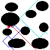

# DBA Practica 3
This project implements discovery drones that explore an unknown 2D map in order to find an object (red square).

Each robot has a radar. They may communicate with each other using messages.

Our implementation uses an agent ("Master of drones") that supervises the exploration according to individual feedback from each individual exploring bot.

This project uses Magentix 2, a platform for multiagent systems, maintained by the Computer Sciences Technology Group at Polytechnic University of Valencia.